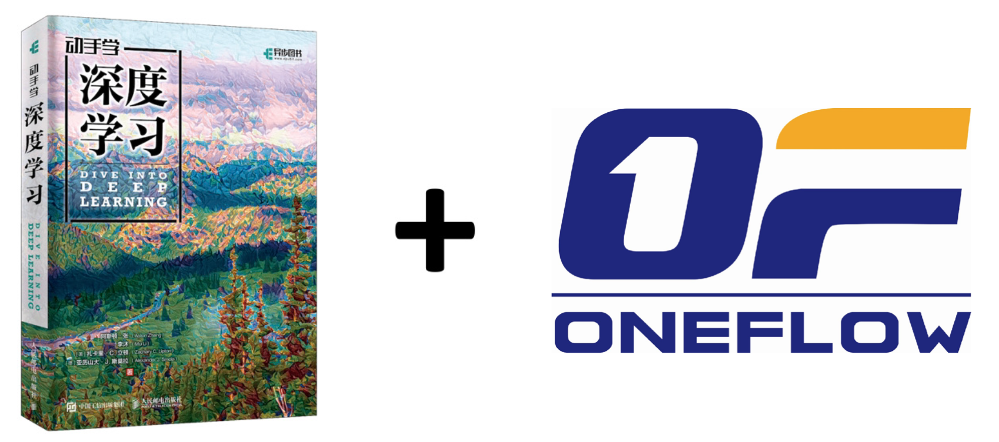

<div align=center>

</div>

**注意** 
* 由于[OneFlow](https://github.com/Oneflow-Inc/oneflow)仍处于快速开发阶段，目前本项目使用的是0.5rc1版本，待0.5版正式发布后，本项目代码会做全面迁移

* 《动手学深度学习》有两个版本，本项目是基于最新版（第二版），该版本更贴近英文版\<Dive into Deep Learning\>
* TODO List
  * markdown优先，其中包含的代码都经过本地测试
  * 中文版翻译润色
  * 创建jupyter notebook，放在colab平台进行托管，无须下载代码即可执行，学习效率更高

不定时更新中......

## 简介

本项目将[《动手学深度学习》第二版](https://zh-v2.d2l.ai/) 中MXNet/PyTorch代码替换为[OneFlow](https://github.com/Oneflow-Inc/oneflow)。原书作者：阿斯顿·张、李沐、扎卡里 C. 立顿、亚历山大 J. 斯莫拉以及其他社区贡献者，GitHub地址：https://github.com/d2l-ai/d2l-zh :clap: :clap: :clap:

另外，本项目也参考了[Dive-into-DL-PyTorch](https://github.com/ShusenTang/Dive-into-DL-PyTorch)和[Dive-into-DL-TensorFlow2.0](https://github.com/TrickyGo/Dive-into-DL-TensorFlow2.0)，在此表示感谢 **RESPECT**。


本仓库主要包含code和docs两个文件夹（外加一些数据存放在data中）。其中code文件夹存的是jupyter notebook文件；docs文件夹存的是markdown文件，然后利用docsify将网页文档部署到GitHub Pages上，[请点击](https://basicv8vc.github.io/Dive-into-DL-OneFlow)。


你还可以在本地访问文档，先安装`docsify-cli`工具:
``` shell
npm i docsify-cli -g
```
然后将本项目clone到本地:
``` shell
git clone https://github.com/basicv8vc/Dive-into-DL-OneFlow
cd Dive-into-DL-OneFlow
```
然后运行一个本地服务器，这样就可以很方便的在`http://localhost:3000`实时访问文档网页渲染效果。
``` shell
docsify serve docs
```

## 面向人群
本项目面向对深度学习感兴趣，尤其是想使用OneFlow进行深度学习的同学。本项目并不要求你有任何深度学习或者机器学习的背景知识，你只需了解基本的线性代数、微积分、概率论和Python即可。

## 原书地址
中文版：[动手学深度学习 (第二版)](https://zh-v2.d2l.ai/) | [Github仓库](https://github.com/d2l-ai/d2l-zh)       
English Version: [Dive into Deep Learning](https://d2l.ai/) | [Github Repo](https://github.com/d2l-ai/d2l-en)


## 引用
如果您在研究中使用了这个项目请引用原书:
```
@book{zhang2019dive,
    title={Dive into Deep Learning},
    author={Aston Zhang and Zachary C. Lipton and Mu Li and Alexander J. Smola},
    note={\url{http://www.d2l.ai}},
    year={2019}
}
```
