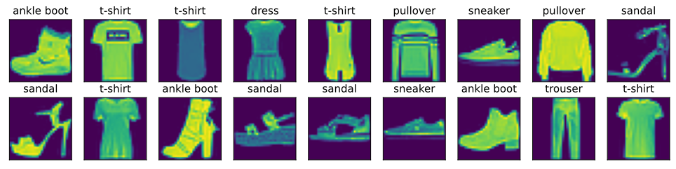

# 图像分类数据集

目前广泛使用的图像分类数据集之一是MNIST数据集[1]。虽然它是很不错的基准数据集，但按今天的标准，即使是简单的模型也能达到95%以上的分类准确率，因此不适合区分强模型和弱模型。如今，MNIST更像是一个健全检查，而不是一个基准。
为了提高难度，我们将在接下来的章节中讨论在2017年发布的性质相似但相对复杂的Fashion-MNIST数据集[2]。

```python
%matplotlib inline
import oneflow as flow
from oneflow.utils import data
import oneflow.utils.vision.transforms as transforms
import matplotlib.pyplot as plt
from utils import *

use_svg_display()
```

## 3.5.1. 读取数据集

我们可以通过OneFlow框架中的内置函数将Fashion-MNIST数据集下载并读取到内存中。

```python
# 通过ToTensor实例将图像数据从PIL类型变换成32位浮点数格式
# 并除以255使得所有像素的数值均在0到1之间
mnist_train = flow.utils.vision.datasets.FashionMNIST(
    root="../data",
    train=True,
    transform=transforms.ToTensor(),
    download=True,
)
mnist_test = flow.utils.vision.datasets.FashionMNIST(
    root="../data",
    train=False,
    transform=transforms.ToTensor(),
    download=True,
)
```
    Downloading http://fashion-mnist.s3-website.eu-central-1.amazonaws.com/train-images-idx3-ubyte.gz
    Downloading http://fashion-mnist.s3-website.eu-central-1.amazonaws.com/train-images-idx3-ubyte.gz to ../data/FashionMNIST/raw/train-images-idx3-ubyte.gz
    26422272/? [05:05<00:00, 66531.70it/s]
    Extracting ../data/FashionMNIST/raw/train-images-idx3-ubyte.gz to ../data/FashionMNIST/raw

    Downloading http://fashion-mnist.s3-website.eu-central-1.amazonaws.com/train-labels-idx1-ubyte.gz
    Downloading http://fashion-mnist.s3-website.eu-central-1.amazonaws.com/train-labels-idx1-ubyte.gz to ../data/FashionMNIST/raw/train-labels-idx1-ubyte.gz
    29696/? [00:00<00:00, 50083.80it/s]
    Extracting ../data/FashionMNIST/raw/train-labels-idx1-ubyte.gz to ../data/FashionMNIST/raw

    Downloading http://fashion-mnist.s3-website.eu-central-1.amazonaws.com/t10k-images-idx3-ubyte.gz
    Downloading http://fashion-mnist.s3-website.eu-central-1.amazonaws.com/t10k-images-idx3-ubyte.gz to ../data/FashionMNIST/raw/t10k-images-idx3-ubyte.gz
    4422656/? [01:33<00:00, 24653.67it/s]
    Extracting ../data/FashionMNIST/raw/t10k-images-idx3-ubyte.gz to ../data/FashionMNIST/raw

    Downloading http://fashion-mnist.s3-website.eu-central-1.amazonaws.com/t10k-labels-idx1-ubyte.gz
    Downloading http://fashion-mnist.s3-website.eu-central-1.amazonaws.com/t10k-labels-idx1-ubyte.gz to ../data/FashionMNIST/raw/t10k-labels-idx1-ubyte.gz
    6144/? [00:00<00:00, 306171.04it/s]
    Extracting ../data/FashionMNIST/raw/t10k-labels-idx1-ubyte.gz to ../data/FashionMNIST/raw

Fashion-MNIST由10个类别的图像组成，每个类别由训练数据集中的6000张图像和测试数据集中的1000张图像组成。*测试数据集*（test dataset）不会用于训练，只用于评估模型性能。训练集和测试集分别包含60000和10000张图像。

```python
len(mnist_train), len(mnist_test)
```
    (60000, 10000)

每个输入图像的高度和宽度均为28像素。数据集由灰度图像组成，其通道数为1。为了简洁起见，在这本书中，我们将高度$h$像素，宽度$w$像素图像的形状记为$h \times w$或（$h$,$w$）。

```python
mnist_train[0][0].shape
```
    flow.Size([1, 28, 28])

Fashion-MNIST中包含的10个类别分别为t-shirt（T恤）、trouser（裤子）、pullover（套衫）、dress（连衣裙）、coat（外套）、sandal（凉鞋）、shirt（衬衫）、sneaker（运动鞋）、bag（包）和ankle boot（短靴）。以下函数用于在数字标签索引及其文本名称之间进行转换。

```python
def get_fashion_mnist_labels(labels):
    """返回Fashion-MNIST数据集的文本标签。"""
    text_labels = ['t-shirt', 'trouser', 'pullover', 'dress', 'coat',
                   'sandal', 'shirt', 'sneaker', 'bag', 'ankle boot']
    return [text_labels[int(i.item())] for i in labels]
```

我们现在可以创建一个函数来可视化这些样本。

```python
def show_images(imgs, num_rows, num_cols, titles=None, scale=1.5):
    """Plot a list of images."""
    figsize = (num_cols * scale, num_rows * scale)
    _, axes = plt.subplots(num_rows, num_cols, figsize=figsize)
    axes = axes.flatten()
    for i, (ax, img) in enumerate(zip(axes, imgs)):
        if isinstance(img, flow._oneflow_internal.Tensor):
            # 图片张量
            ax.imshow(img.numpy())
        else:
            # PIL图片
            ax.imshow(img)
        ax.axes.get_xaxis().set_visible(False)
        ax.axes.get_yaxis().set_visible(False)
        if titles:
            ax.set_title(titles[i])
    return axes
```

以下是训练数据集中前几个样本的图像及其相应的标签（文本形式）。

```python
X, y = next(iter(data.DataLoader(mnist_train, batch_size=18)))
show_images(X.reshape(18, 28, 28), 2, 9, titles=get_fashion_mnist_labels(y));
```
<div align=center>

</div>

## 3.5.2. 读取小批量

为了使我们在读取训练集和测试集时更容易，我们使用内置的数据迭代器，而不是从零开始创建一个。
回顾一下，在每次迭代中，数据加载器每次都会读取一小批量数据，大小为`batch_size`。我们在训练数据迭代器中还随机打乱了所有样本。

```python
batch_size = 256

def get_dataloader_workers():
    """使用4个进程来读取数据。"""
    return 4

train_iter = data.DataLoader(mnist_train, batch_size, shuffle=True,
                             num_workers=get_dataloader_workers())
```

让我们看一下读取训练数据所需的时间。

```python
timer = Timer()
for X, y in train_iter:
    continue
f'{timer.stop():.2f} sec'
```

## 3.5.3. 整合所有组件

现在我们定义`load_data_fashion_mnist`函数，用于获取和读取Fashion-MNIST数据集。它返回训练集和验证集的数据迭代器。此外，它还接受一个可选参数，用来将图像大小调整为另一种形状。

```python
def load_data_fashion_mnist(batch_size, resize=None):
    """下载Fashion-MNIST数据集，然后将其加载到内存中。"""
    trans = [transforms.ToTensor()]
    if resize:
        trans.insert(0, transforms.Resize(resize))
    trans = transforms.Compose(trans)
    mnist_train = flow.utils.vision.datasets.FashionMNIST(
        root="../data", train=True, transform=trans, download=True)
    mnist_test = flow.utils.vision.datasets.FashionMNIST(
        root="../data", train=False, transform=trans, download=True)
    return (data.DataLoader(mnist_train, batch_size, shuffle=True,
                            num_workers=get_dataloader_workers()),
            data.DataLoader(mnist_test, batch_size, shuffle=False,
                            num_workers=get_dataloader_workers()))
```


下面，我们通过指定`resize`参数来测试`load_data_fashion_mnist`函数的图像大小调整功能。

```python
train_iter, test_iter = load_data_fashion_mnist(32, resize=64)
for X, y in train_iter:
    print(X.shape, X.dtype, y.shape, y.dtype)
    break
```
    flow.Size([32, 1, 64, 64]) oneflow.float32 flow.Size([32]) oneflow.int64

我们现在已经准备好在下面的章节中使用Fashion-MNIST数据集。

## 3.5.4. 小结

* Fashion-MNIST是一个服装分类数据集，由10个类别的图像组成。我们将在后续章节中使用此数据集来评估各种分类算法。
* 我们将高度$h$像素，宽度$w$像素图像的形状记为$h \times w$或（$h$,$w$）。
* 数据迭代器是获得更高性能的关键组件。依靠实现良好的数据迭代器，利用高性能计算来避免减慢训练过程。

## 3.5.5. 练习

1. 减少`batch_size`（如减少到1）是否会影响读取性能？
1. 数据迭代器的性能非常重要。你认为当前的实现足够快吗？探索各种选择来改进它。
1. 查阅框架的在线API文档。还有哪些其他数据集可用？

参考文献

[1] LeCun, Y., Bottou, L., Bengio, Y., Haffner, P., & others. (1998). Gradient-based learning applied to document recognition. Proceedings of the IEEE, 86(11), 2278–2324.

[2] Xiao, H., Rasul, K., & Vollgraf, R. (2017). Fashion-mnist: a novel image dataset for benchmarking machine learning algorithms. arXiv preprint arXiv:1708.07747.
