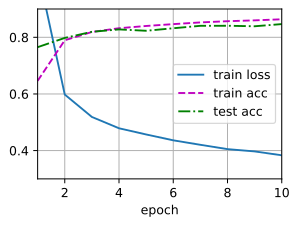

# 多层感知机的简洁实现

正如你所期待的，我们可以通过高级API更简洁地实现多层感知机。

```python
import oneflow as flow
from oneflow import nn
import numpy as np
from utils import *
```

## 4.3.1. 模型

与softmax回归的简洁实现（3.7节）相比，唯一的区别是我们添加了2个全连接层（之前我们只添加了1个全连接层）。第一层是隐藏层，它包含256个隐藏单元，并使用了ReLU激活函数。第二层是输出层。

```python
net = nn.Sequential(nn.Flatten(),
                    nn.Linear(784, 256),
                    nn.ReLU(),
                    nn.Linear(256, 10))

def init_weights(m):
    if type(m) == nn.Linear:
        nn.init.normal_(m.weight, std=0.01)

net.apply(init_weights);
```

训练过程的实现与我们实现softmax回归时完全相同，这种模块化设计使我们能够将与和模型架构有关的内容独立出来。

```python
batch_size, lr, num_epochs = 256, 0.1, 10
loss = nn.CrossEntropyLoss()
trainer = flow.optim.SGD(net.parameters(), lr=lr)

train_iter, test_iter = load_data_fashion_mnist(batch_size)
train_ch3(net, train_iter, test_iter, loss, num_epochs, trainer)
```
<div align=center>

</div>

## 4.3.2. 小结

* 我们可以使用高级API更简洁地实现多层感知机。
* 对于相同的分类问题，多层感知机的实现与softmax回归的实现相同，只是多层感知机的实现里增加了带有激活函数的隐藏层。

## 4.3.3. 练习

1. 尝试添加不同数量的隐藏层（也可以修改学习率）。怎么样设置效果最好？
1. 尝试不同的激活函数。哪个效果最好？
1. 尝试不同的方案来初始化权重。什么方法效果最好？
