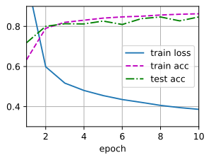
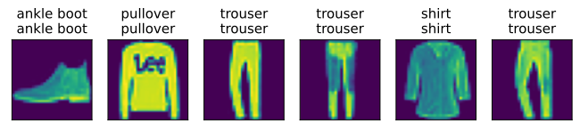

# 从零开始实现多层感知机

我们已经在数学上描述了多层感知机（MLP），现在让我们尝试自己实现一个多层感知机。为了与我们之前使用softmax回归（3.6节）获得的结果进行比较，我们将继续使用Fashion-MNIST图像分类数据集（3.5节）。

```python
import oneflow as flow
from oneflow import nn
import numpy as np
from utils import *

batch_size = 256
train_iter, test_iter = load_data_fashion_mnist(batch_size)
```

## 4.2.1. 初始化模型参数

回想一下，Fashion-MNIST中的每个图像由$28 \times 28 = 784$个灰度像素值组成。所有图像共分为10个类别。忽略像素之间的空间结构，我们可以将每个图像视为具有784个输入特征和10个类的简单分类数据集。首先，我们将实现一个具有单隐藏层的多层感知机，它包含256个隐藏单元。注意，我们可以将这两个量都视为超参数。通常，我们选择2的若干次幂作为层的宽度。因为内存在硬件中的分配和寻址方式，这么做往往可以在计算上更高效。

我们用几个张量来表示我们的参数。注意，对于每一层我们都要记录一个权重矩阵和一个偏置向量。跟以前一样，我们要为这些参数的损失的梯度分配内存。

```python
num_inputs, num_outputs, num_hiddens = 784, 10, 256

W1 = nn.Parameter(flow.randn(
    num_inputs, num_hiddens, requires_grad=True) * 0.01)
b1 = nn.Parameter(flow.zeros(num_hiddens, requires_grad=True))
W2 = nn.Parameter(flow.randn(
    num_hiddens, num_outputs, requires_grad=True) * 0.01)
b2 = nn.Parameter(flow.zeros(num_outputs, requires_grad=True))

params = [W1, b1, W2, b2]
```

## 4.2.2. 激活函数

为了确保我们知道一切是如何工作的，我们将使用最大值函数自己实现ReLU激活函数，而不是直接调用内置的`relu`函数。

```python
def relu(X):
    mask = flow.tensor(X < 0, dtype=flow.int)
    return flow.masked_fill(X, mask, 0)
```

## 4.2.3. 模型

因为我们忽略了空间结构，所以我们使用`reshape`将每个二维图像转换为一个长度为`num_inputs`的向量。我们只需几行代码就可以实现我们的模型。

```python
def net(X):
    X = X.reshape(-1, num_inputs)
    H = relu(flow.matmul(X, W1) + b1)
    return (flow.matmul(H, W2) + b2)
```

## 4.2.4. 损失函数

为了确保数值稳定性，同时由于我们已经从零实现过softmax函数（3.6节），因此在这里我们直接使用高级API中的内置函数来计算softmax和交叉熵损失。回想一下我们之前在3.7.2节中对这些复杂问题的讨论。我们鼓励感兴趣的读者查看损失函数的源代码，以加深对实现细节的了解。

```python
loss = nn.CrossEntropyLoss()
```

## 4.2.5. 训练

幸运的是，多层感知机的训练过程与softmax回归的训练过程完全相同。可以直接调用`utils.py`中的`train_ch3`函数（参见3.6节），将迭代周期数设置为10，并将学习率设置为0.1.

```python
num_epochs, lr = 10, 0.1
updater = flow.optim.SGD(params, lr=lr)
train_ch3(net, train_iter, test_iter, loss, num_epochs, updater)
```
<div align=center>

</div>

为了对学习到的模型进行评估，我们将在一些测试数据上应用这个模型。

```python
predict_ch3(net, test_iter)
```

<div align=center>

</div>

## 4.2.6. 小结

* 我们看到即使手动实现一个简单的多层感知机也是很容易的。
* 然而，如果有大量的层，从零开始实现多层感知机会变得很麻烦（例如，要命名和记录模型的参数）。

## 4.2.7. 练习

1. 在所有其他参数保持不变的情况下，更改超参数`num_hiddens`的值，并查看此超参数的变化对结果有何影响。确定此超参数的最佳值。
1. 尝试添加更多的隐藏层，并查看它对结果有何影响。
1. 改变学习速率会如何影响结果？保持模型结构和其他超参数(包括迭代周期数)不变，学习率设置为多少会带来最好的结果？
1. 通过对所有超参数(学习率、迭代周期数、隐藏层数、每层的隐藏单元数)进行联合优化，可以得到的最佳结果是什么？
1. 描述为什么涉及多个超参数更具挑战性。
1. 如果要构建多个超参数的搜索方法，你能想到的最聪明的策略是什么？
